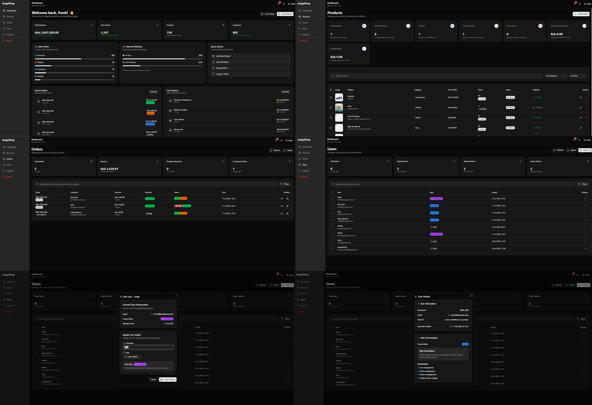
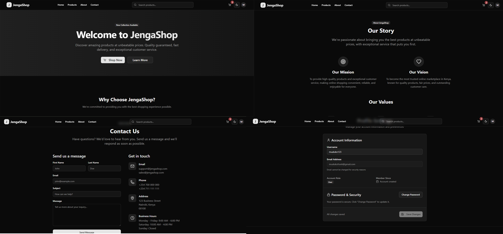

# JengaShop

A modern e-commerce platform built with a monorepo architecture using Turborepo, featuring a React client, admin dashboard, and Express API.

## Architecture

- **Client** - Customer-facing React app with Vite, TypeScript, and Tailwind CSS
- **Dashboard** - Admin panel for managing products, orders, and users
- **API** - Express.js backend with authentication, file uploads, and email services
- **Database** - Prisma ORM with PostgreSQL

## Quick Start

```bash
# Install dependencies
pnpm install

# Start development servers
pnpm dev

# Build all apps
pnpm build

# Start production servers
pnpm start
```

## Environment Setup

Copy `.env.example` files in api directory and configure your environment variables:

- `apps/api/.env` 
- `packages/database/.env` 

## Development

Each app runs on a different port:
- Client: http://localhost:5173
- Dashboard: http://localhost:3000  

## Tech Stack

- **Frontend**: React 19, TypeScript, Tailwind CSS, Vite
- **Backend**: Express.js, TypeScript, Prisma
- **Database**: PostgreSQL
- **File Storage**: Cloudinary
- **Monorepo**: Turborepo, pnpm workspaces

## Dashboard


## Client
